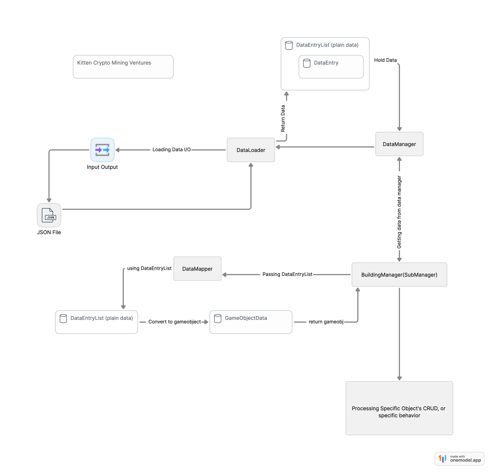

------

# Kitten Crypto Mining Ventures

## Description

This is an incrementalizer game, a story of a cat mining for cat coins, by purchasing a graphics card and mining for cat coins inside different machine rooms. Keep getting better graphics cards and guarding your own server room.

## Getting Started

### Prerequisites

List any prerequisites, libraries, OS version, etc., needed before installing the program.

- Unity Editor (Version: 2022.3.16f1 LTS)
- .NET Framework (Version)
- Additional Package 
  - TextMeshPro
  - Dotwin

### Installation

Step by step series of examples that tell you how to get a development environment running.

1. Clone the repository: `git clone https://github.com/RandomNameORG/kitten-crypto-mining-ventures`
2. Navigate to the cloned directory.
3. Open the project using Unity Editor.

### Running the Game

Instructions on how to run the game in a development environment.

1. build the game by youself
1. run it and try it

## Contributing

State if you are open to contributions and what your requirements are for accepting them.

- For major changes, please open an issue first to discuss what you would like to change.
- Please make sure to update tests as appropriate.

## Game Data Structure

## License
This project is licensed under the MIT License - see the LICENSE file for details
