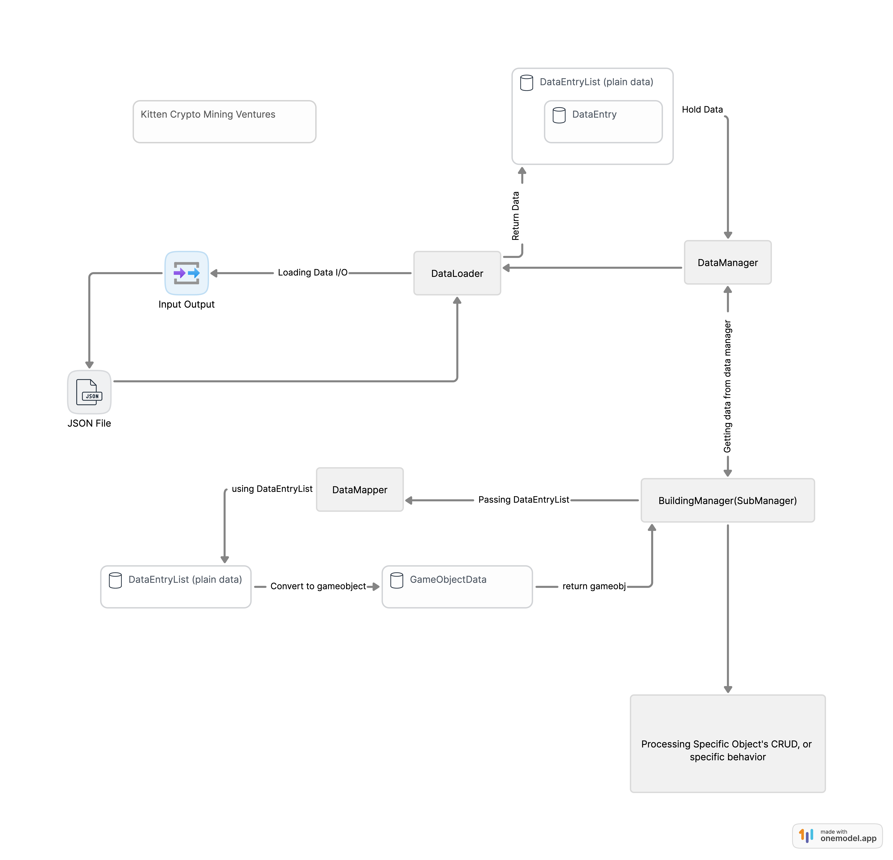

# Kitten Crypto Mining Ventures

## Description

An incremental/tycoon game where you play a cat running a crypto mining operation. Purchase GPU graphics cards, place them in building cells, upgrade your server rooms, and grow your mining empire. Built on Godot 4 with GDScript.

## Getting Started

### Prerequisites

- Godot 4.3 or newer

### Installation

1. Clone the repository: `git clone https://github.com/RandomNameORG/kitten-crypto-mining-ventures`
2. `cd kitten-crypto-mining-ventures`
3. Open `project.godot` in the Godot editor.

### Running the Game

- From the editor: press F5 (main scene is `scenes/main_menu.tscn`).
- From the CLI: run `godot --path .` from the repo root.

## Contributing

For major changes, please open an issue first to discuss what you would like to change.

## Game Data Structure

## License

This project is licensed under the MIT License - see the LICENSE file for details.
